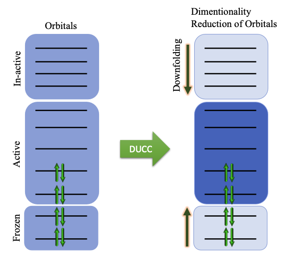

  

# DUCC

A python package to run double unitary coupled cluster (DUCC) calculations.

[//]: # (Badges)
[//]: # 
[//]: #

### Installation
1. Download

        git clone https://github.com/codebyharjeet/DUCC.git
        cd DUCC

2. Create conda environment

        conda create --name ducc_env "python=3.7.12"
        conda activate ducc_env

3. To do the installation in development mode

        pip install -e .

4. Try running tests to make sure it is working

        pytest test/*.py
